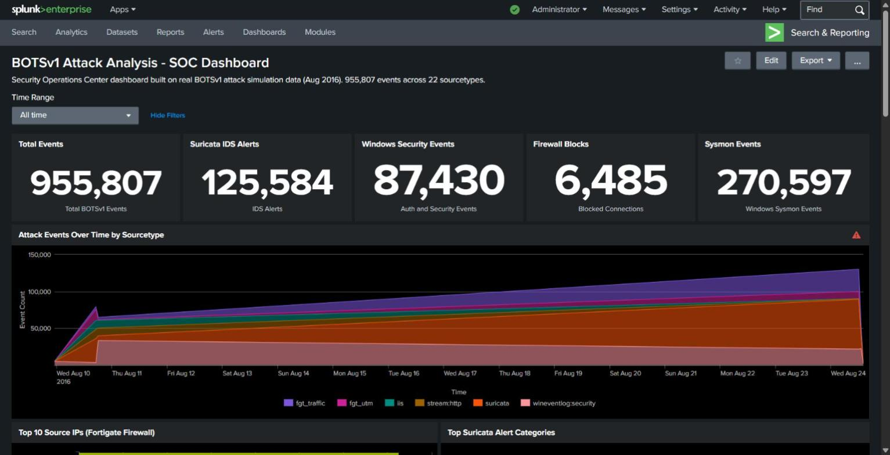

# Splunk SIEM Homelab

   

A hands-on Security Operations Center (SOC) home lab built on **Splunk Enterprise 10.2.1** using real-world attack simulation data from the **Splunk Boss of the SOC Version 1 (BOTSv1)** dataset. This project demonstrates threat detection, log analysis, and incident investigation across 955,807 events and 22 sourcetypes.

---

## Overview

This lab simulates a corporate network under active attack during August 2016. The BOTSv1 dataset captures a full attack campaign including web application attacks, lateral movement via SMB, command-and-control DNS beaconing, privilege escalation, and malware execution — all detectable through Splunk.

**Key stats:**
- 955,807 total events
- 22 sourcetypes
- Attack timeline: August 10–24, 2016
- Splunk Enterprise 10.2.1 on Windows

---

## Environment

| Component | Details |
|-----------|---------|
| SIEM Platform | Splunk Enterprise 10.2.1 |
| OS | Windows 10 |
| Dataset | BOTSv1 Attack-Only Dataset |
| Index | `botsv1` |
| Dashboard | BOTSv1 Attack Analysis - SOC Dashboard |
| Hosts Monitored | we8105desk, we1149srv, we9041srv |

---

## Dashboard



The **BOTSv1 Attack Analysis - SOC Dashboard** provides real-time visibility into the simulated attack campaign with the following panels:

| Panel | Description |
|-------|-------------|
| Total Events | 955,807 BOTSv1 events across all sourcetypes |
| Suricata IDS Alerts | 125,584 network intrusion detection alerts |
| Windows Security Events | 87,430 authentication and security events |
| Firewall Blocks | 6,485 denied connections (Fortigate UTM) |
| Sysmon Events | 270,597 Windows process/network/registry events |
| Attack Timeline | Stacked area chart of events Aug 10-24, 2016 |
| Top Source IPs | External attacker IPs identified via Fortigate |
| Suricata Alert Categories | Web Application Attack, Privilege Gain, Network Trojan |
| Country Heatmap | Attack traffic from US, China, Germany, Russia |
| Process Creation by Account | Suspicious accounts: joomla, IUSR, bob.smith |
| Suricata IDS Alert Details | XSS, SQL Injection, CVE exploits, scanner detection |
| DNS C2 Detection | hostby.guardomicro.com (996 queries), ns.kirov.ru (436) |
| SMB Lateral Movement | smb2 create/write/read between internal hosts |
| Privilege Escalation | Administrator SeSecurityPrivilege (2,382 events) |
| Registry Changes | Certificate store tampering on we8105desk |
| Sysmon Host Activity | Malware host identification by event volume |

---

## Attack Patterns Detected

### 1. Web Application Attack (Joomla CMS)
- **Sourcetype:** `iis`, `stream:http`, `suricata`
- **Indicators:** XSS attempts in URI, XXE SYSTEM ENTITY in POST body, SQL Injection SELECT FROM, Acunetix v6 scanner detected
- **Suricata Signatures:** `ET WEB_SERVER Script tag in URI`, `ET WEB_SERVER Possible XXE SYSTEM ENTITY`, `ET SCAN Acunetix Version 6`
- **SPL:**
```spl
index=botsv1 sourcetype=suricata event_type=alert
| stats count by alert.signature, alert.category
| sort -count | head 15
```

### 2. Command & Control via DNS Beaconing
- **Sourcetype:** `stream:dns`
- **Indicators:** 996 queries to `hostby.guardomicro.com`, 436 queries to `ns.kirov.ru` (Russian DNS)
- **SPL:**
```spl
index=botsv1 sourcetype=stream:dns
| mvexpand hostname{}
| stats count by hostname{}
| sort -count | head 20
```

### 3. SMB Lateral Movement
- **Sourcetype:** `stream:smb`
- **Indicators:** 5,503 `smb2 create` operations from 192.168.250.100 → 192.168.250.20
- **SPL:**
```spl
index=botsv1 sourcetype="stream:smb"
| stats count by src_ip, dest_ip, command
| sort -count | head 15
```

### 4. Privilege Escalation
- **Sourcetype:** `wineventlog:security`
- **Event:** EventCode 4672 (Special privileges assigned to new logon)
- **Indicators:** Administrator account assigned SeSecurityPrivilege 2,382 times
- **SPL:**
```spl
index=botsv1 sourcetype="wineventlog:security" EventCode=4672
| stats count by Account_Name, Privileges
| sort -count
```

### 5. Malware Execution (Sysmon)
- **Sourcetype:** `xmlwineventlog:microsoft-windows-sysmon/operational`
- **Indicators:** we8105desk generated 130,353 Sysmon events — highest of any host
- **Registry:** Certificate store modifications at `HKLM\software\microsoft\enterprisecertificates\disallowed`
- **SPL:**
```spl
index=botsv1 sourcetype=winregistry
| stats count by host, key_path, process_image
| sort -count | head 20
```

---

## Sourcetype Coverage

| Sourcetype | Event Count | Description |
|-----------|-------------|-------------|
| `xmlwineventlog:microsoft-windows-sysmon/operational` | 270,597 | Windows Sysmon (process, network, registry) |
| `stream:smb` | 151,568 | SMB file sharing traffic |
| `suricata` | 125,584 | Network IDS alerts |
| `wineventlog:security` | 87,430 | Windows Security event log |
| `winregistry` | 74,720 | Windows Registry changes |
| `stream:ip` | 62,083 | Raw IP streams |
| `fgt_traffic` | 55,279 | Fortigate firewall traffic |
| `stream:tcp` | 28,291 | TCP streams |
| `fgt_utm` | 25,586 | Fortigate UTM (web filtering, AV) |
| `stream:http` | 23,936 | HTTP traffic streams |
| `iis` | 22,615 | Microsoft IIS web server logs |
| `stream:dns` | 7,434 | DNS query/response streams |

---

## Setup Instructions

### Prerequisites
- Splunk Enterprise (free license supports up to 500MB/day; BOTSv1 attack-only dataset fits within limits)
- Windows 10/11
- BOTSv1 attack-only dataset (downloaded from Splunk's GitHub)

### Data Loading

1. Create the index in Splunk:
   - Settings → Indexes → New Index
   - Name: `botsv1`, leave all other settings as default

2. Extract the BOTSv1 `.tar` file and copy to Splunk:
```
C:\Program Files\Splunk\var\lib\splunk\botsv1\
```
   The folder should contain `colddb`, `db`, and `thaweddb` subfolders.

3. Restart Splunk services.

4. **Important:** When searching, always set the time range to **All time** — BOTSv1 data is from August 2016.

### Import the Dashboard

1. In Splunk: Settings → User Interface → Views → New
2. Or navigate to Dashboards → Create New Dashboard → Classic Dashboards
3. Click Source and paste the dashboard XML from `dashboard/botsv1_soc_dashboard.xml`

---

## Key Findings

| Finding | Evidence |
|---------|---------|
| Web server compromise via Joomla | XSS + SQL injection + scanner alerts in IIS/Suricata |
| C2 beaconing | 996 DNS queries to `hostby.guardomicro.com` |
| Lateral movement | SMB2 create/write from 192.168.250.100 to .20 |
| Privilege escalation | Admin SeSecurityPrivilege 2,382x (EventCode 4672) |
| Certificate store tamper | `HKLM\enterprisecertificates\disallowed` modified |
| Malware host | `we8105desk` with 130,353 Sysmon events |

---

## Skills Demonstrated

- Splunk Enterprise installation, configuration, and index management
- BOTSv1 CTF dataset loading and troubleshooting (time range issue resolution)
- Custom Classic Dashboard creation with 16+ panels using real attack data
- SPL (Splunk Processing Language) query writing across multiple sourcetypes
- Threat hunting: web attacks, C2 DNS, lateral movement, privilege escalation
- Log analysis: Sysmon, Windows Security Events, Suricata IDS, Fortigate firewall
- Incident investigation methodology aligned with MITRE ATT&CK framework

---

## MITRE ATT&CK Mapping

| Technique | ID | Evidence |
|-----------|-----|---------|
| Exploit Public-Facing Application | T1190 | Joomla XSS/SQLi via IIS |
| Command and Control - DNS | T1071.004 | hostby.guardomicro.com beaconing |
| Lateral Movement - SMB | T1021.002 | smb2 create/write between hosts |
| Privilege Escalation | T1068 | EventCode 4672 - SeSecurityPrivilege |
| Modify Registry | T1112 | Certificate store tampering |
| Process Injection | T1055 | Suspicious Sysmon EventCode 1 |

---

## Files in This Repo

```
splunk-siem-homelab/
├── README.md                          # This file
├── dashboard/
│   └── botsv1_soc_dashboard.xml      # Splunk Classic Dashboard XML
└── searches/
    └── key_spl_queries.md            # Key SPL queries for threat hunting
```

---

## Author

**Dhruv Shah** | [@dhruvshah-cyber](https://github.com/dhruvshah-cyber)

Built as a hands-on cybersecurity portfolio project demonstrating real SIEM skills using production-grade tools and real attack data.
